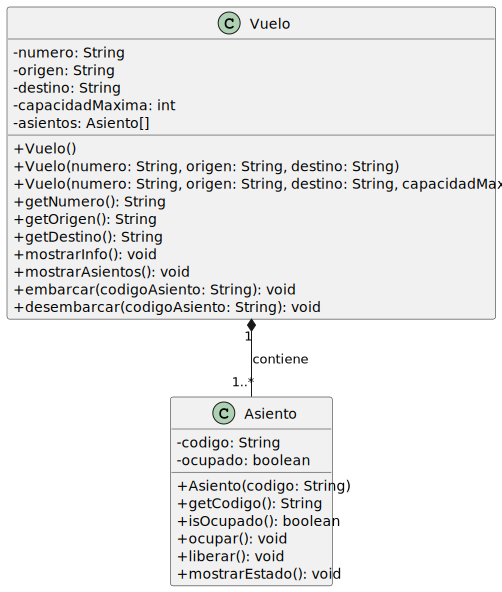

# Ejercicio Composición: Vuelo y Asiento

**"Un objeto está formado por otros. Sin el todo, las partes no tienen sentido."**

La parte no puede existir sin el todo. Si el objeto principal se destruye, sus partes también. El ejemplo clásico: un `Vuelo` tiene `Asientos`. Un asiento sin vuelo no tiene sentido.

> El asiento no tiene sentido sin el vuelo que lo creó. El vuelo instancia sus propios asientos internamente. Eso es **composición**.

## Descripción

Este ejercicio modela la relación entre un `Vuelo` y sus `Asiento`s. El vuelo crea sus propios asientos al momento de construirse: un asiento no tiene sentido sin el vuelo al que pertenece. Si el vuelo desaparece, sus asientos desaparecen con él.

Este tipo de relación se llama **composición**.

## Clases

- `Asiento` — representa un asiento con su código y estado de ocupación.
- `Vuelo` — representa un vuelo que crea y gestiona sus propios asientos.
- `App` — clase principal donde se crean los objetos y se prueba la interacción.

## Diagrama UML

<!-- Generar SVG con: java -jar plantuml.jar -tsvg README.md -->

<!--
```
@startuml composicion-vuelo-asiento
skinparam classAttributeIconSize 0

class Asiento {
    - codigo: String
    - ocupado: boolean
    + Asiento(codigo: String)
    + getCodigo(): String
    + isOcupado(): boolean
    + ocupar(): void
    + liberar(): void
    + mostrarEstado(): void
}

class Vuelo {
    - numero: String
    - origen: String
    - destino: String
    - capacidadMaxima: int
    - asientos: Asiento[]
    + Vuelo()
    + Vuelo(numero: String, origen: String, destino: String)
    + Vuelo(numero: String, origen: String, destino: String, capacidadMaxima: int)
    + getNumero(): String
    + getOrigen(): String
    + getDestino(): String
    + mostrarInfo(): void
    + mostrarAsientos(): void
    + embarcar(codigoAsiento: String): void
    + desembarcar(codigoAsiento: String): void
}

Vuelo "1" *-- "1..*" Asiento : contiene
@enduml
```
-->



## Instrucciones

1. Crea la clase `Asiento` con los atributos `codigo` y `ocupado` como `private`.
2. Agrega un constructor que reciba `codigo`. El asiento inicia siempre como desocupado.
3. Agrega getters para `codigo` y `ocupado`.
4. Implementa `ocupar()`: si ya está ocupado, avisa; si no, lo marca como ocupado.
5. Implementa `liberar()`: marca el asiento como libre.
6. Implementa `mostrarEstado()`: imprime el código y si está ocupado o libre.
7. Crea la clase `Vuelo` con los atributos `numero`, `origen`, `destino`, `capacidadMaxima` y `asientos` como `private`.
8. Agrega tres constructores: vacío, con ruta (número, origen, destino), y completo (agrega capacidad). El constructor completo debe crear automáticamente los asientos con códigos `"A1"`, `"A2"`, `"A3"`... hasta la capacidad.
9. Implementa `mostrarInfo()`: imprime el número, la ruta y la capacidad.
10. Implementa `mostrarAsientos()`: llama a `mostrarEstado()` de cada asiento.
11. Implementa `embarcar(String codigoAsiento)`: busca el asiento por código y lo ocupa. Si no existe, avisa.
12. Implementa `desembarcar(String codigoAsiento)`: busca el asiento y lo libera. Si no existe, avisa.

## En `App.java`

1. Crea un vuelo con capacidad de 5 asientos usando el constructor completo.
2. Embarca pasajeros en tres asientos específicos (por ejemplo `"A1"`, `"A3"`, `"A5"`).
3. Intenta embarcar en un asiento ya ocupado.
4. Muestra el estado de todos los asientos.
5. Desembarca uno y vuelve a mostrar el estado.

## Salida esperada

```
---- Vuelo AV9401 ----
Ruta: Bogotá → Medellín
Capacidad: 5 asientos

Asiento A1 ocupado.
Asiento A3 ocupado.
Asiento A5 ocupado.
El asiento A1 ya está ocupado.

Estado de asientos — Vuelo AV9401:
Asiento A1: ocupado
Asiento A2: libre
Asiento A3: ocupado
Asiento A4: libre
Asiento A5: ocupado

Asiento A3 liberado.
Estado de asientos — Vuelo AV9401:
Asiento A1: ocupado
Asiento A2: libre
Asiento A3: libre
Asiento A4: libre
Asiento A5: ocupado
```

## Pregunta para reflexionar

¿Tiene sentido que un `Asiento` exista sin su `Vuelo`? ¿En qué parte del código puedes ver evidencia de que el vuelo es quien crea los asientos, y no al revés?